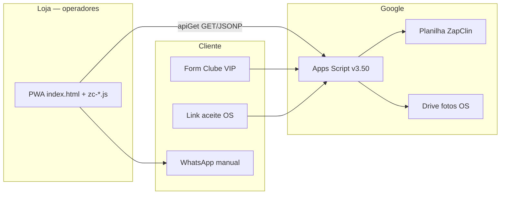
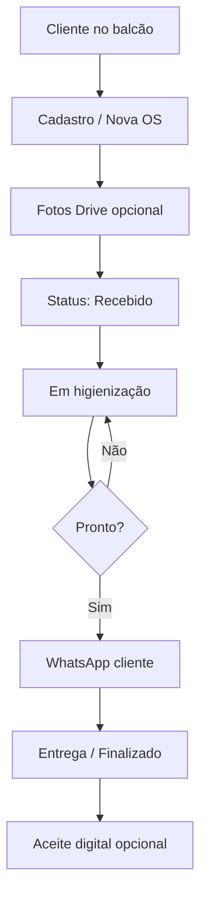
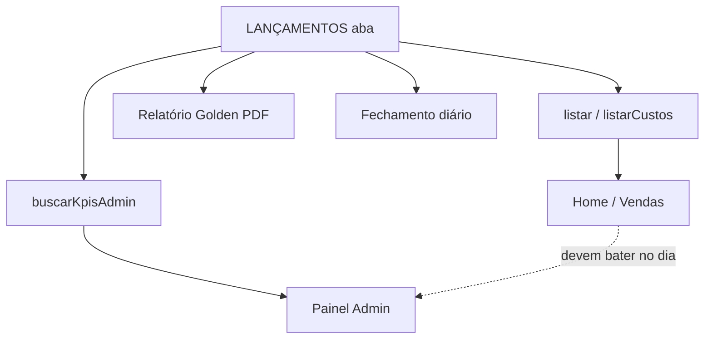
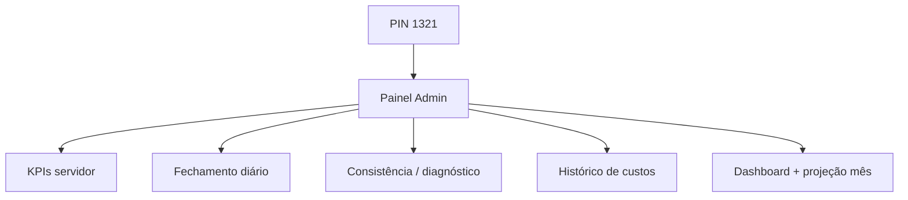
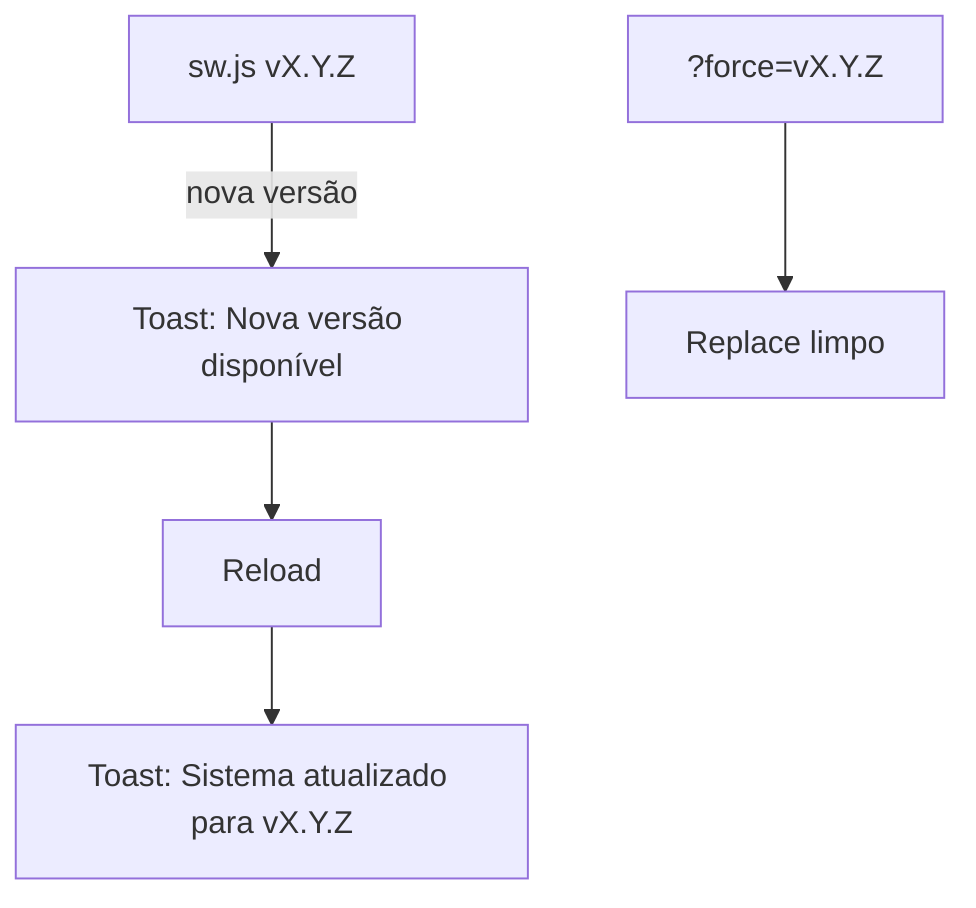
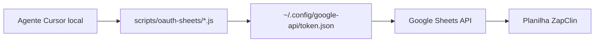

# ZapClin — Fluxos operacionais

**Atualizado:** 21/07/2026  
**Produção:** FE **v4.33.3** · GAS **3.50**  
**Complementa:** `MAPA_CODIGO_ARQUITETURA.md`, `PROTOCOLO_DIAGNOSTICO_E_TESTES.md`

---

## 1. Visão geral (sistema)

---

## 2. Fluxo balcão — OS / status

**Zonas:** Z2 operação · WhatsApp = zona crítica (não automatizar envio sem pedido).

---

## 3. Fluxo financeiro — lançamento e KPI

**Regra:** ranges dinâmicos (desde v3.45) — não truncar em linha 600.

---

## 4. Fluxo Admin (PIN 1321)

---

## 5. Fluxo PWA / versão (oficial pós-14/07)

**Proibido (incidente 14/07):** SW off permanente, banner full-screen, servir HTML no lugar de `zc-*.js`, boot forçado a cada bump. Ver `ERROS_PWA_2026-07-14.md`.

---

## 6. Fluxo OAuth Desktop → planilha

Smoke seguro: aba `OAUTH_SMOKE` (`test-zapclin-write.js`).  
Doc: `OAUTH_PLANILHA_DESKTOP.md`.

---

## 7. Mapa protocolo Z0–Z6

| ID | Fluxo | Auto | Loja |
|----|-------|------|------|
| Z0 | Ping / diagnóstico | `.ps1` | — |
| Z1 | KPI Home = Admin | `.ps1` | Confirmar UI |
| Z2 | Fila OS / status | Parcial | Sim |
| Z3 | CRM / VIP / fotos | Parcial | Sim |
| Z4 | Aceite OS | Parcial | Sim |
| Z5 | WhatsApp textos/links | Manual | Sim |
| Z6 | Golden / fechamento | Manual | Sim |

Detalhe: `PROTOCOLO_DIAGNOSTICO_E_TESTES.md`.
