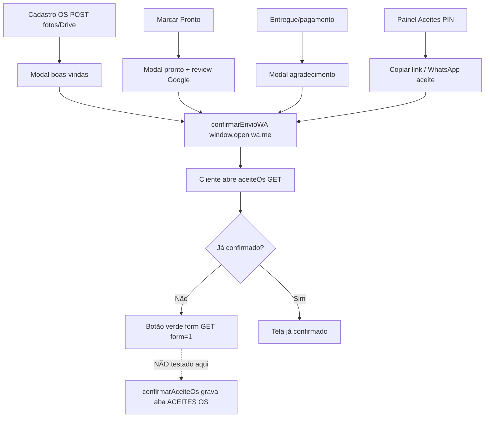

# Auditoria WhatsApp + Aceite OS — 14/08/2026

**Tipo:** varredura readonly (sem gravar planilha, sem `confirmarAceiteOs`).  
**Branch:** `cursor/auditoria-wa-aceite-62bf`  
**Alvo:** produção GitHub Pages + GAS Deploy ID canônico.  
**Início:** 2026-08-14T14:32:36.717Z  
**Fim:** 2026-08-14T14:32:56.673Z  

## Resultado

| Status | Qtde |
|--------|------|
| PASS | 39 |
| FAIL | 7 |
| WARN | 1 |

O fluxo operacional **existe e está ligado ponta a ponta** (cadastro → modal WA → wa.me; Pronto → mensagem + review; painel Aceites → link GAS; cliente abre formulário GET). A matriz **REGRAS §3 de telefone/clipboard/fallback não está implementada** em `confirmarEnvioWA` — isso é FAIL de conformidade, não de “link quebrado”.

Números de celular **já com 11 dígitos** (padrão da loja `98 98147-9616`) abrem o WhatsApp certo. O buraco é número antigo de 10 dígitos e telefone lixo.

## Validação etapa a etapa

| # | Etapa | Esperado | Evidência | Veredito |
|---|--------|----------|-----------|----------|
| 1 | Cadastro OS no balcão | Após POST Drive, abre modal `boasVindas` | `zc-clientes.js` `_executarSalvarCliente` → `mostrarWaModal('boasVindas')`; CRM idem | PASS (código) |
| 2 | Modal preview | `#waModal` + botão `confirmarEnvioWA()` | `index.html` linhas do modal | PASS |
| 3 | Montagem da mensagem de recebimento | OS + aceite digital + VIP (1ª visita) | sandbox `msgBoasVindas` contém `?action=aceiteOs` e `?action=cadastroVip` no WEB_APP canônico | PASS |
| 4 | Clique “Enviar no WhatsApp” | `https://wa.me/55…?text=` | `confirmarEnvioWA` Pages = repo; abre `wa.me` | PASS canal / **FAIL** nono dígito em 10 dígitos |
| 5 | Normalização BR §3 | `98 9242-8208` → `5598992428208`; inválido bloqueia; clipboard; fallback | harness TEL-* | **FAIL** (só 11 dígitos OK) |
| 6 | Marcar Pronto | Modal `pronto` + Google review + IG | `_executarMarcarStatus` (3 caminhos) + card Operação | PASS |
| 7 | Entregue / pagamento | Modal `agradecimento` | `confirmarPagamento` | PASS |
| 8 | Painel Aceites (PIN) | Lista pendentes/confirmados; WhatsApp + copiar link | `page-aceites` + `enviarAceiteWhatsApp_` / `copiarLinkAceiteOs` | PASS |
| 9 | Link aceite no GAS | `WEB_APP?action=aceiteOs&os=` | `listarClientes` 321 URLs canônicas, 0 mismatch | PASS |
| 10 | Cliente abre OS inexistente | “OS não encontrada” | GET `aceiteOs` e `os=999999` HTTP 200 | PASS |
| 11 | Cliente abre OS pendente | Botão verde + form GET `confirmarAceiteOs&form=1` | OS **#000345** GET readonly (não submetido) | PASS |
| 12 | Cliente abre OS já aceita | “Aceite já confirmado” sem botão | OS **#000343** | PASS |
| 13 | Confirmar aceite | Grava aba `ACEITES OS` | **não executado** (escrita) | — |
| 14 | Clube VIP no link da msg | Form `cadastroVip` / `salvarCadastroVip` | GET form OK; submit não feito | PASS (leitura) |
| 15 | Review Google (msg Pronto) | `g.page/r/CcTInX7dYxLwEBM/review` | HTTP 200 → `search.google.com/local/writereview?placeid=ChIJ4XW3sEOT9gcRxMidft1jEvA` | PASS |
| 16 | WhatsApp da loja (site) | `wa.me/5598981479616` | site live + redirect `api.whatsapp.com/send/?phone=5598981479616` | PASS |
| 17 | Instagram handle | `@zapclinhigienizacao` nas msgs | perfil HTTP 200; PWA não coloca URL clicável | PASS / WARN UX |

### Achado operacional (não é bug de link)

Planilha em 14/08/2026 14:32 UTC: **345 OS**, **24 aceites confirmados**, **49 OS ativas ainda pendentes** de aceite. O mecanismo funciona; a cobertura documental na loja está baixa.

### Formulario real OS #000345 (somente GET — botão não clicado)

```html
<form method="get" action="https://script.google.com/macros/s/AKfycbx1MKIovW80bcjwRcqoGG88Oyh24N6UQdO9BjTcowMkq2iDLUiqhokUPQ2Hf_d5w_8yLg/exec">
  <input type="hidden" name="action" value="confirmarAceiteOs">
  <input type="hidden" name="form" value="1">
  <input type="hidden" name="os" value="345">
  <button type="submit">Aceito as condições da OS</button>
</form>
```

## Fluxo esperado (código atual)



Envio **não é automático**: o operador confirma no modal. WhatsApp Web/app abre com texto pré-preenchido.

## Evidência live (sanitizada)

- GAS ping: `{"ok":true,"version":"3.52","timezone":"America/Los_Angeles"}`
- Pages `APP_VERSION`: `v4.34.0`
- `listarClientes`: {"status":200,"ok":true,"version":"3.52","count":345,"timeSec":3.736768}
- Contadores aceite: `{"total":345,"pendente":321,"confirmado":24,"urlOk":321,"urlMissing":24,"urlMismatch":0,"ativosPendentes":49,"ativosConfirmados":6}`
- OS amostra (só número, sem PII): `{"pendenteAtivo":{"os":345,"statusOs":"Em andamento","aceiteStatus":"PENDENTE","hasUrl":true},"confirmado":{"os":343,"statusOs":"Em andamento","aceiteStatus":"CONFIRMADO","hasUrl":false}}`
- Google review final: `https://accounts.google.com/v3/signin/identifier?continue=https://search.google.com/local/writereview?placeid%3DChIJ4XW3sEOT9gcRxMidft1jEvA%26source%3Dg.page.m.ia._%26laa%3Dnmx-review-solicitation-ia2&flowName=WebLiteSignIn&flowEntry=ServiceLogin&dsh=S-549771593:1786717975058873`
- wa.me loja final: `https://api.whatsapp.com/send/?phone=5598981479616&text&type=phone_number&app_absent=0`

## FAILs

- `CODE-CLIPBOARD-ANTES-WA` — REGRAS §3: copiar mensagem antes de abrir WA — NÃO implementado em confirmarEnvioWA (clipboard só em copiarLinkAceiteOs / resumo OS)
- `CODE-FALLBACK-WA` — REGRAS §3: fallback se app WhatsApp não abrir — NÃO implementado (só window.open wa.me)
- `TEL-10_dígitos_+_nono` — "98 9242-8208" → atual wa.me/559892428208 ≠ spec 5598992428208
- `TEL-INVALIDO-1` — Entrada "(vazio)" deveria bloquear envio; código atual monta wa.me/55
- `TEL-INVALIDO-2` — Entrada "123" deveria bloquear envio; código atual monta wa.me/55123
- `TEL-INVALIDO-3` — Entrada "999" deveria bloquear envio; código atual monta wa.me/55999
- `TEL-INVALIDO-4` — Entrada "abcdefgh" deveria bloquear envio; código atual monta wa.me/55

## WARNs

- `CODE-GAS-CONFIRM-JSON-SURFACE` — doGet também aceita confirmarAceiteOs sem form=1 (JSON) — superfície de escrita pública por OS

## PASSes

- `CODE-WEBAPP` — zc-version.js WEB_APP bate com Deploy ID canônico
- `CODE-DEPLOY` — Deploy ID único presente em WEB_APP
- `CODE-REVIEW-CONST` — GOOGLE_REVIEW_URL constante
- `CODE-MODAL` — Modal #waModal + botão Enviar no WhatsApp → confirmarEnvioWA()
- `CODE-PAINEL-ACEITE` — Painel Admin Aceites: WhatsApp + copiar link
- `CODE-GATILHOS` — Gatilhos: cadastro OS, Pronto (status+Operação), Entregue, CRM nova OS
- `CODE-GAS-ACEITE-GET` — GAS doGet aceiteOs renderiza formulário HTML (leitura)
- `CODE-GAS-CONFIRM-FORM` — Confirmação documental exige form=1 (GET HTML) — harness não executa
- `CODE-GAS-VIP` — GAS cadastroVip HTML público
- `TEL-11_dígitos_sem_duplicar_9` — "98 99242-8208" → atual wa.me/5598992428208 = spec
- `TEL-formatado_11_dígitos` — "(98) 99242-8208" → atual wa.me/5598992428208 = spec
- `TEL-já_internacional` — "5598992428208" → atual wa.me/5598992428208 = spec
- `TEL-loja_11_dígitos` — "98 98147-9616" → atual wa.me/5598981479616 = spec
- `TEL-zero_à_esquerda` — "098 99242-8208" → atual wa.me/5598992428208 = spec
- `SEND-WA-ME-HOST` — confirmarEnvioWA abre https://wa.me/<tel>?text=… (número 10 dígitos coberto em TEL-*) → https://wa.me/559892428208
- `MSG-ACEITE-URL` — aceiteOsUrl_ = WEB_APP?action=aceiteOs&os=
- `MSG-VIP-URL` — clienteVipUrl_ aponta para cadastroVip no mesmo WEB_APP
- `MSG-BOAS-LINKS` — Boas-vindas inclui link de aceite digital + Clube VIP
- `MSG-PRONTO-LINKS` — Pronto inclui Google review + @zapclinhigienizacao
- `MSG-ACEITE-DEDICADA` — Mensagem dedicada do painel Aceites carrega a URL da OS
- `MSG-AGRADECIMENTO` — Agradecimento pós-retirada cita Instagram da loja
- `SITE-WA-LOJA` — site/index.html usa wa.me/5598981479616
- `LIVE-PING` — GAS ping version=3.52 tz=America/Los_Angeles 2.431777s
- `LIVE-PAGES-VERSION` — GitHub Pages APP_VERSION=v4.34.0 WEB_APP canônico
- `LIVE-PAGES-WA-PARITY` — confirmarEnvioWA Pages = repo main
- `LIVE-SW` — sw.js Pages HTTP 200 v4.34.0
- `LIVE-ACEITE-SEM-OS` — aceiteOs sem OS → página "OS não encontrada" (HTTP 200, 4.093527s)
- `LIVE-ACEITE-OS-INEXISTENTE` — aceiteOs&os=999999 → OS não encontrada
- `LIVE-LISTAR-CLIENTES` — listarClientes ok version=3.52 items=345 3.736768s
- `LIVE-ACEITE-URLS-GAS` — URLs aceite do GAS: ok=321 missing=24 mismatch=0 (missing esperado em CONFIRMADO: mapa da aba não grava url)
- `LIVE-ACEITE-CONTADORES` — Aceites: 24 confirmados / 321 pendentes · ativos pendentes=49 · ativos confirmados=6
- `LIVE-ACEITE-FORM-PENDENTE` — OS #000345 GET readonly: botão verde + form GET confirmarAceiteOs&form=1 (2.38987s)
- `LIVE-ACEITE-FORM-CONFIRMADO` — OS #000343 já CONFIRMADO: tela "já confirmado" sem botão
- `LIVE-VIP-FORM` — cadastroVip HTML público carrega formulário (sem submit) 1.409264s
- `LIVE-GOOGLE-REVIEW` — Google review HTTP 200 final=https://accounts.google.com/v3/signin/identifier?continue=https://search.google.com/local/writereview?placeid%3DChIJ4XW3sEOT9gcRxMidft1jEvA%26source%3Dg.page.m.ia._%26laa%3Dnmx-review-solicitation-ia2&flowName=WebLiteSignIn&flowEntry=ServiceLogin&dsh=S-549771593:1786717975058873
- `LIVE-WAME-LOJA` — wa.me/5598981479616 HTTP 200 final=https://api.whatsapp.com/send/?phone=5598981479616&text&type=phone_number&app_absent=0
- `LIVE-INSTAGRAM` — instagram.com/zapclinhigienizacao HTTP 200 (handle nas msgs; não é URL clicável no PWA)
- `LIVE-SITE-WA` — www.zapclinslz.com HTTP 200 contém wa.me da loja
- `LIVE-NO-WRITE` — Nenhuma action de escrita chamada (confirmarAceiteOs, salvarCadastroVip, salvar, atualizarStatus)

## O que não foi executado (de propósito)

- `confirmarAceiteOs` / clique no botão verde em OS real — **grava planilha**.
- `salvarCadastroVip` — **grava planilha**.
- Cadastro de OS + fotos — POST Drive.
- Homologação no tablet da loja (abrir WhatsApp nativo) — só humano.
- Matriz §3 “fallback se o app não abrir” no aparelho físico.

## Correção sugerida (só com pedido explícito — zona crítica WhatsApp)

1. `normalizarTelWA_`: inserir 9 após DDD em números nacionais de 10 dígitos; não duplicar se já houver 11.
2. Bloquear envio se o resultado não for `55` + 11 dígitos com 3º dígito nacional `9`.
3. Copiar `waData.msg` para clipboard antes de `window.open`.
4. Se `window.open` falhar, tentar `https://api.whatsapp.com/send?phone=...`.

**Não alterar templates de mensagem nem Deploy ID sem pedido.**

JSON bruto (sem PII): `scripts/testes/evidencias/auditoria-wa-aceite-2026-08-14.json`

Mudança no AppScript: **não**. Canônico: `AppsScript_v3.45_ATUAL.gs`.
